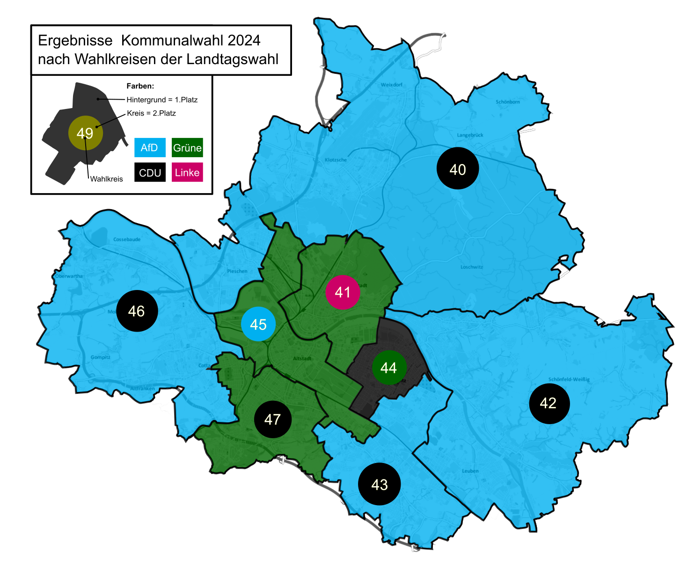
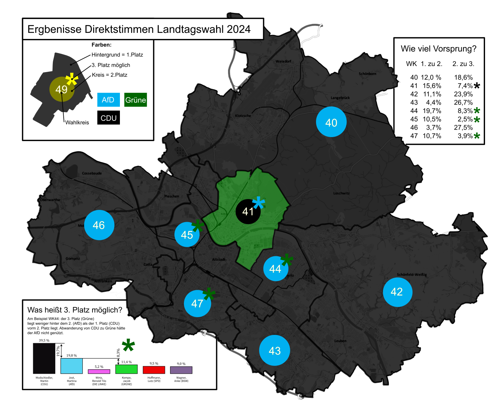

# Analyse vor der Wahl
Ich höre um mich rum viele Menschen, die sich Gedanken um die Landtagswahl machen und die sagen "Ich muss ja [Partei A] verhindern. Darum kann ich nicht [Partei B] wählen, wie ich das wollte sondern muss meine Stimme strategisch [Partei C] geben." Ich hatte auch die Überlegung für die Erststimme und habe mir darum nochmal die Ergebnisse der diesjährigen Kommunalwahl angeschaut. Die Wahlkreise sind etwas anders, darum musste ich ein bisschen rechnen. Das Ergebnis würde ich gern teilen, ohne weitere Wahlempfehlungen auszusprechen. Da bei der Erststimme im Mehrheitswahlrecht nur der Sieger eines Wahlkreises zählt, habe ich nur den ersten und den zweiten Platz der Kommunalwahl dargestellt.

Vielleicht hilft Euch das für die Entscheidung, ob ihr strategisch [Partei C] wählen wollt oder nicht. Es hängt sehr vom jeweiligen Wahlkreis ab!

Ich weiß auch, dass die Direktwahl eine Personenwahl ist und darum nicht einfach von der Kommunalwahl auf die Landtagswahl abgebildet werden kann.

# Update nach der Wahl

Ich habe mir das Ergebnis mal unter dem Aspekt der Direktstimmen angeschaut und muss sagen, die Strategie von [Partei C] ist aufgegangen, sich als die Partei der Brandmauer darzustellen. Sie hat fast alle Direktmandate in Dresden gewonnen und in Dresden damit auch kein Direktmandat der [Partei A] zugelassen. 

Ich habe mich natürlich gefragt, ob meine Analyse mit Blick aufs Ergebnis ein schlechter Rat war. Ich bin nicht der Meinung! 

Man muss aber etwas genauer hinschauen. Ich habe mich gefragt, was passiert wäre, wenn sich mehr Wähler gegen die taktische [Partei C]-Stimme entschieden hätten und stattdessen [Partei B] gewählt hätten. Hätte das [Partei A] genützt und ein Direktmandat verschafft? Um die Frage zu beantworten habe ich die Abstände zwischen den Direktmandatsstimmergebnissen angeschaut. Liegt der 1. Platz näher am 2. Platz als der 3. Platz, würde eine Wählerwanderung von 1. zu 3. Platz dem 2. Platz  nützen - und andersrum. Schaut Euch am besten das Beispiel an. Dann wird's klarer.

